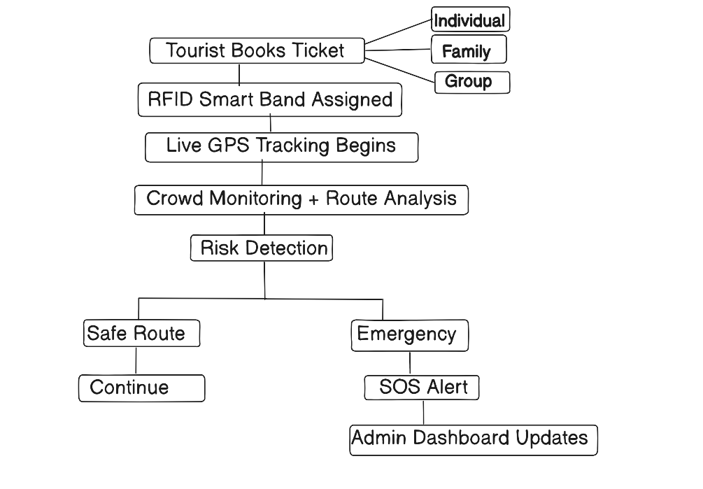
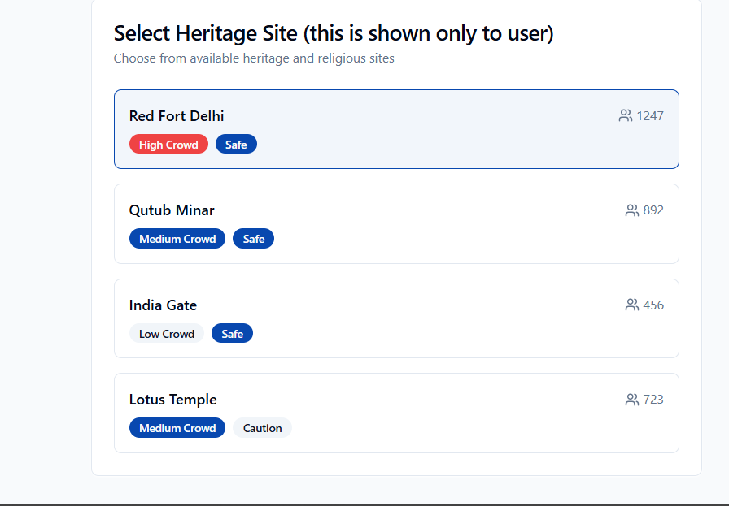
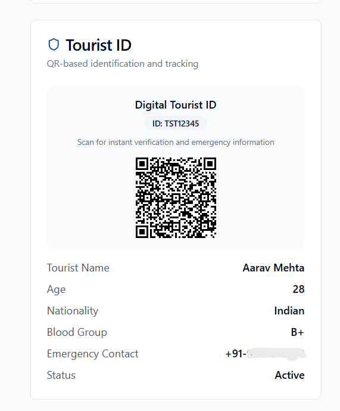

# Safe Track Go

A smart tourism safety platform designed to improve traveler safety across heritage sites, pilgrimage destinations, and adventure locations.

---

## Project Workflow

---

## Live Demo

🔗 https://safe-track-go.vercel.app/

---

## Screenshots

### Heritage Site Safety Dashboard

Features demonstrated:

- RFID Smart Band
- Ticket Booking
- Live Crowd Heatmap
- Site Monitoring
- Crowd Density Analysis

---

### Digital Tourist ID

Features demonstrated:

- QR Verification
- Tourist Identification
- Emergency Information
- Journey Tracking

---

## Technology Stack

Frontend

- React.js
- TypeScript
- Tailwind CSS
- shadcn/ui
- Vite

Backend & Services

- Supabase
- GPS APIs
- RFID Smart Band Integration
- QR Code Generation

---

## Team

Developed as a prototype for building safer and smarter tourism experiences through intelligent monitoring, wearable technology, and real-time safety analytics.
